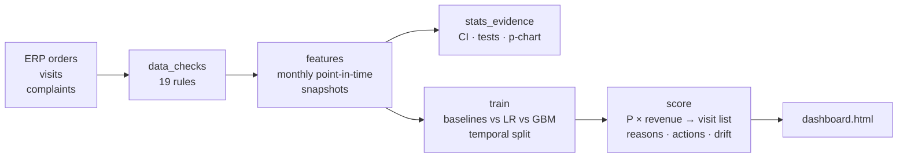

# Churn Early-Warning Dashboard · PT Segar Nusantara

**Applied Data Science with AI (RevoU × ITB) · Capstone Project · Sample submission**

> Ranks retail partners by their risk of going inactive, **weighted by revenue at stake**, so the field team spends its 200 monthly retention visits where they protect the most revenue.

  

> ⚠️ **Sample capstone output.** Built on the PT Segar Nusantara anchor case using a **synthetic dataset** generated by this repo. All outlets, sales reps and figures are fictional.

---

## The result in one table

Back-test on May–Jul 2026 (data the model never saw), 200 visits per month:

| | Today: "longest-silent first" | **This product (v1.2)** |
|---|---:|---:|
| Revenue-at-risk put in front of reps | 43.9% | **68.6%** |
| Listed outlets that really churned (hit rate) | 47.7% | 43.8% |
| Annual revenue of churning outlets reached / month | ≈ Rp 5.6 bn | **≈ Rp 8.7 bn** |

Plus a statistical-process-control alarm: **Jawa Timur churn has been out of control since January 2026** (20.8% vs 9.0% nationally), matching a competitor's entry.

## What's in the box

| Capstone deliverable | Where |
|---|---|
| Decision brief + success metric | [`reports/01_decision_brief.md`](reports/01_decision_brief.md) |
| Validated analytical dataset | [`src/segar_churn/data_checks.py`](src/segar_churn/data_checks.py) → [`reports/data_quality_log.md`](reports/data_quality_log.md) |
| Statistical evidence (CI, hypothesis tests, p-chart) | [`src/segar_churn/stats_evidence.py`](src/segar_churn/stats_evidence.py) → [`reports/evidence.json`](reports/evidence.json) |
| Model benchmarked against baseline | [`reports/02_model_report.md`](reports/02_model_report.md) · [`reports/metrics.json`](reports/metrics.json) |
| Explainability & bias review | [`reports/03_explainability_bias_review.md`](reports/03_explainability_bias_review.md) |
| Working interface for non-technical users | [`app/dashboard.html`](app/dashboard.html) (single file, open in any browser) |
| Recommendation memo | [`reports/04_recommendation_memo.md`](reports/04_recommendation_memo.md) |
| Monitoring / governance plan | [`reports/05_monitoring_governance_plan.md`](reports/05_monitoring_governance_plan.md) |
| Stakeholder pushback & revision note | [`reports/06_stakeholder_pushback_revision_note.md`](reports/06_stakeholder_pushback_revision_note.md) |
| AI-use log | [`reports/07_ai_use_log.md`](reports/07_ai_use_log.md) |
| Panel defense run sheet | [`reports/08_panel_defense_outline.md`](reports/08_panel_defense_outline.md) |
| This month's visit list | [`outputs/visit_list_2026-09-30.csv`](outputs/visit_list_2026-09-30.csv) |
| Walkthrough notebook (Colab-friendly) | [`notebooks/walkthrough.ipynb`](notebooks/walkthrough.ipynb) |

## Run it

```bash
git clone <this-repo> && cd segar-churn-early-warning
pip install -r requirements.txt
make test      # 13 tests, incl. the no-future-leakage test
make all       # raw data -> checks -> features -> stats -> train -> explain -> score -> dashboard  (~1 min)
open app/dashboard.html
```

No `make`? `PYTHONPATH=src python -m segar_churn.pipeline` does the same. Works in Google Colab and Cloud Shell.

To run on the program's anchor dataset (or your own anonymised export), drop the four CSVs into `data/raw/` with the columns in [`data/README.md`](data/README.md) and run `PYTHONPATH=src python -m segar_churn.pipeline --use-existing-raw`.

## How it works



1. **Churn** = an active outlet places no order in the next 60 days.
2. Each month-end, 18 signals are computed using **only data available on that date** (enforced by `tests/test_features.py`).
3. A logistic regression estimates P(churn). Outlets are ranked by **expected revenue lost = P × annualised revenue**.
4. The list policy: 160 slots by expected loss (minimum 5% risk) + 40 slots reserved for the highest-risk warungs.
5. Each listed outlet gets up to three plain-language reasons and a suggested action.

## Model performance (test window, May–Jul 2026)

| Approach | Revenue-at-risk @200 | Hit rate @200 | ROC-AUC | PR-AUC |
|---|---:|---:|---:|---:|
| Baseline: longest-silent first | 43.9% | 47.7% | 0.830 | 0.509 |
| Baseline: silent >30d, biggest first | 47.4% | 46.2% | 0.823 | 0.403 |
| Logistic regression, ranked by P only | 35.5% | 49.5% | 0.888 | 0.603 |
| Logistic regression, P × revenue (v1.0) | 70.0% | 25.8% | 0.888 | 0.603 |
| **Deployed policy v1.2** (warung lane + 5% floor) | **68.6%** | **43.8%** | 0.888 | 0.603 |
| Challenger: gradient boosting, P × revenue | 72.4% | 28.8% | 0.902 | 0.640 |

The lesson the panel should hear: **the business framing (ranking by expected loss) moved the result more than the choice of algorithm.**

## Repo layout

```
├── app/
│   ├── dashboard_template.html   # the interface (vanilla HTML/JS, no server)
│   ├── build_dashboard.py        # embeds latest scores -> dashboard.html
│   └── dashboard.html            # ← open this
├── data/README.md                # data dictionary; raw/processed are generated
├── notebooks/walkthrough.ipynb   # guided tour calling the package
├── outputs/                      # visit list, all scores, drift report
├── reports/                      # checkpoint write-ups, figures, metrics
├── src/segar_churn/
│   ├── config.py                 # every business number in one place
│   ├── generate_data.py          # synthetic anchor dataset
│   ├── data_checks.py            # validation + cleaning
│   ├── features.py               # point-in-time snapshots
│   ├── stats_evidence.py         # Checkpoint 1 statistics
│   ├── modeling.py               # candidates, baselines, business metrics, visit policy
│   ├── train.py                  # selection + test + figures
│   ├── explain.py                # importance, reason codes, bias review
│   ├── score.py                  # monthly run, drift, dashboard payload
│   └── pipeline.py               # end to end
├── tests/                        # pytest
├── Makefile
└── .github/workflows/ci.yml      # tests + full cold run on every push
```

## Tools

Python (pandas, SciPy, statsmodels, scikit-learn, matplotlib) · Google Colab · GitHub Actions · Claude Code (refactoring, tests, dashboard scaffold, from Week 4) · Gemini (critique and stakeholder role-play). See the [AI-use log](reports/07_ai_use_log.md) for exactly what each was used for.
