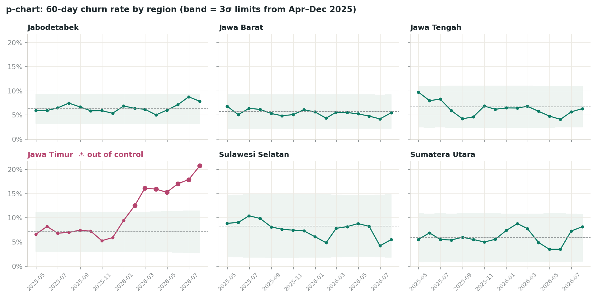

# Checkpoint 1 — Evidence & Decision Brief

**Case:** PT Segar Nusantara (FMCG distributor, anchor case) · **Owner:** capstone participant · **Status:** self-reviewed, end of Week 3
**Data:** synthetic stand-in for the anchor dataset (see `data/README.md`). Numbers below are reproduced by `make checks evidence`.

---

## 1. The decision

> **Every month, which retail partners should the field sales team visit to stop them going inactive, given they can make only 200 extra retention visits?**

| | |
|---|---|
| **Decision owner** | Head of Sales (approves the list); 6 Area Sales Managers (assign visits) |
| **Decision frequency** | Monthly, on the 1st working day |
| **Action** | A rep visit or call within 7 days, with a reason and suggested talking point |
| **Constraint** | 200 extra visits / month across ~57 reps (≈3–4 each on top of their normal route) |
| **Today's practice** | Reps chase "whoever hasn't ordered for longest", from memory or an ERP export |

### What "churn" means here
An outlet that ordered at least once in the last 3 months (**active**) and then places **no order in the next 60 days**.
60 days was agreed with the Head of Sales: shorter windows flagged normal gaps in small warungs' ordering; longer windows meant the outlet had usually already switched supplier by the time we noticed.

### Why revenue-weighted, not just "most likely to churn"
A 90% risk on a warung buying Rp 15m a year and a 20% risk on a supermarket buying Rp 900m a year are not the same problem. The list is ranked on **expected revenue lost = P(churn) × annualised revenue at stake**.

## 2. Success metric (fixed before modelling)

**Primary:** *Revenue-at-risk captured @200*: of the annualised revenue belonging to outlets that actually went quiet in the next 60 days, the share that was on our 200-outlet list.

| Target | Value | Rationale |
|---|---|---|
| Must beat today's method | > 44% (recency baseline, back-test) | otherwise there is no reason to change behaviour |
| Program target | **≥ 60%** | agreed with Head of Sales as "worth changing the process for" |

**Guardrails** (reported every month, not optimised):
- Hit rate of the list (precision@200) must not fall far below today's ~48%: reps lose trust in lists full of healthy outlets.
- Every outlet type and region must get some coverage (see bias review, Checkpoint 2B).

**Business outcome the metric serves:** reduce annualised revenue lost to partner churn, currently **≈ Rp 10.4 bn of annual revenue walking out every month** (mean over Apr-2025 to Jul-2026).

## 3. Validated analytical dataset

| Table | Grain | Clean rows | Key checks |
|---|---|---:|---|
| `outlets` | retail partner | 2,600 | unique ID, valid type, 26 missing cities filled |
| `orders` | invoice | 173,799 | 520 ERP double-postings removed, 12 credit notes keyed as orders removed, 3 future-dated (year typo) removed |
| `visits` | rep visit | 77,891 | all outlet IDs exist in master |
| `complaints` | complaint / return | 6,341 | all outlet IDs exist in master |

Full log: [`data_quality_log.md`](data_quality_log.md). Checks are code (`src/segar_churn/data_checks.py`) and run on every refresh; BLOCK-level failures stop the pipeline.

The modelling table is a **monthly point-in-time panel**: one row per active outlet per month-end, features computed only from data up to that date, label from the following 60 days. 16 labelled snapshots (Apr-2025 to Jul-2026), 32,119 outlet-months, ~2,000 active outlets each month.

## 4. Statistical evidence

All tests on a single snapshot (31-Jul-2026, n = 1,990 outlets) so observations are independent.

**The problem is real and sizeable.**
60-day churn rate is **9.0% (95% Wilson CI 7.8%–10.3%)**, about 180 outlets every two months.

| Outlet type | n | Churn rate | 95% CI | Annualised revenue lost |
|---|---:|---:|---|---:|
| Warung | 844 | 11.5% | 9.5–13.8% | Rp 1.0 bn |
| Minimarket | 522 | 8.4% | 6.3–11.1% | Rp 2.2 bn |
| Grosir | 385 | 7.5% | 5.3–10.6% | Rp 4.4 bn |
| Supermarket | 239 | 3.8% | 2.0–7.0% | Rp 2.8 bn |

Warungs churn most often, but grosir and supermarkets carry most of the money. This is the tension the decision has to handle.

**The signals we plan to use separate churners from retained outlets.**

| Hypothesis | Test | Result |
|---|---|---|
| H1: Late payers (>14 days on average) churn more | two-proportion z | **46.8% vs 7.4%**, z = 12.0, p < 0.001 (n = 79 vs 1,911) |
| H2: Churners' SKU range is shrinking beforehand | Mann–Whitney U (one-sided) | median change **−20.5% vs 0.0%**, p < 0.001, rank-biserial r = 0.46 |
| H3: Outlets with no rep visit in 60 days churn more | two-proportion z | **28.9% vs 6.3%**, z = 11.4, p < 0.001 |
| H4: Churn differs by region | χ², 5 dof | χ² = 65.5, p < 0.001; Jawa Timur 20.8% vs 5–8% elsewhere |

H3 is observational. Reps may already avoid outlets they believe are lost (reverse causality). We **do not** claim visits prevent churn; the governance plan includes a randomised holdout to measure that.

**Churn is not stable: statistical quality control.**
A p-chart per region with 3σ limits set on Apr–Dec 2025 shows **Jawa Timur out of control every month from January 2026**, matching the entry of a rival distributor reported by the regional manager. The other five regions stay inside their limits.

Implication for the model: Jawa Timur's 2026 behaviour is partly a new regime. Validation must be temporal (train on the past, test on later months), never a random split.

## 5. Scope and assumptions

- In scope: active outlets in 6 regions; the monthly visit list. Out of scope: pricing, credit-limit decisions, new-outlet acquisition.
- Assumes the ERP order date is when the outlet placed the order (not delivery date). Confirmed with Sales Ops.
- Revenue at stake = last-90-day revenue × 4. Seasonal businesses (e.g. Ramadan peaks) will be over- or under-stated; flagged for review.
- No personal data used: outlet owner names and phone numbers are excluded from the analytical dataset.

## 6. Self-review checklist

- [x] Decision, owner and action stated in one sentence
- [x] Success metric defined before modelling, with a baseline to beat
- [x] Dataset validated with logged, re-runnable checks
- [x] Statistical evidence: CI, hypothesis tests, SQC, with independence noted
- [x] Known limitation (H3 causality) flagged, not hidden
