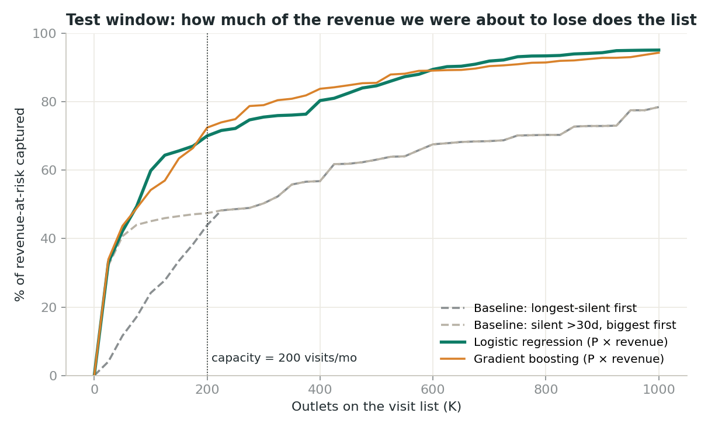
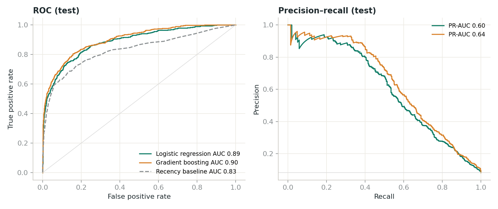
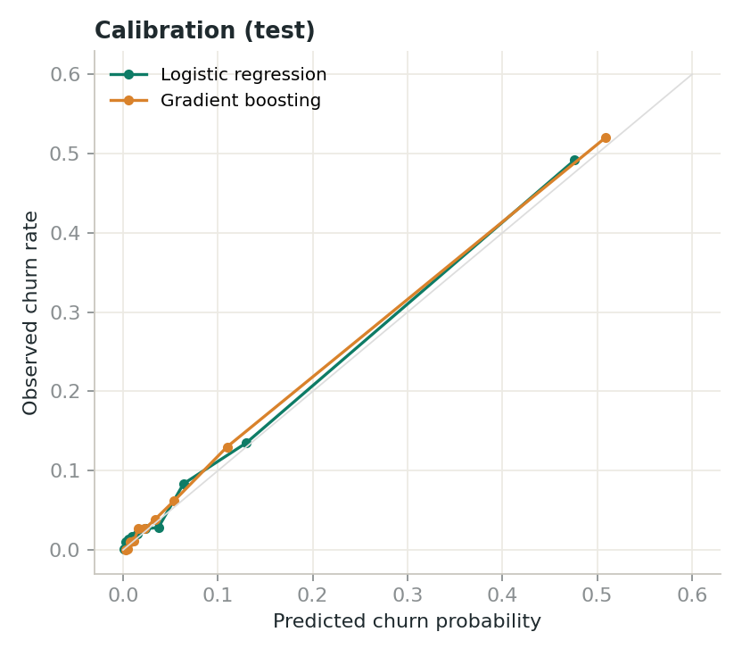

# Checkpoint 2, Part A — Validated Model

**Status:** reviewed with mentor in the Week 5 live check-in (formative). Built by hand in Colab; refactored into `src/` with Claude Code from Week 4 onward (see [07_ai_use_log.md](07_ai_use_log.md)).
Reproduce: `make features train` → `reports/metrics.json`, `reports/figures/`.

---

## 1. Set-up

| | |
|---|---|
| Task | Binary classification: will an active outlet place **no order in the next 60 days**? |
| Unit | outlet × month-end snapshot |
| Features (18) | recency; orders, revenue and SKU range in the last 90 days and their trend vs the prior 90; payment lateness; discount level; rep visits; complaints; tenure; distance to depot; outlet type; region |
| Ranking used for the decision | **expected revenue lost = P(churn) × annualised revenue at stake** |

### Temporal validation (no random shuffling)

| Split | Snapshots | Outlet-months | Churn rate |
|---|---|---:|---:|
| Train | Apr-2025 → Jan-2026 | 20,096 | 6.6% |
| Validation (model + policy selection) | Feb-2026 → Apr-2026 | 6,026 | 7.6% |
| Test (touched once) | May-2026 → Jul-2026 | 5,997 | 8.3% |

The test window includes the Jawa Timur competitor shock, so it is a harder, more realistic test than a random split. Every top-K metric is computed per month (each month is a separate 200-visit decision) and averaged.

## 2. Baselines

Two baselines encode what the sales team does today, so "better than baseline" means "better than the current process", not "better than a coin flip".

1. **Longest-silent first:** rank by days since last order.
2. **Manager's rule:** anyone silent > 30 days, biggest accounts first.

## 3. Results

### Validation (used to choose)

| Approach | Revenue-at-risk captured @200 | Hit rate @200 | ROC-AUC | PR-AUC |
|---|---:|---:|---:|---:|
| Baseline: longest-silent first | 35.9% | 44.7% | 0.837 | 0.465 |
| Baseline: silent >30d, biggest first | 38.1% | 42.7% | 0.831 | 0.374 |
| **Logistic regression** (P × revenue) | **61.5%** | 24.2% | 0.888 | 0.578 |
| Gradient boosting (P × revenue) | 60.8% | 27.2% | 0.888 | 0.606 |

Selection rule, fixed in advance: highest revenue-at-risk captured on validation → **logistic regression**. The two models are within 1 point; the tie-break would also have favoured logistic regression for transparency.

### Test (reported once)

| Approach | Revenue-at-risk captured @200 | Hit rate @200 | Churners reached | ROC-AUC | PR-AUC | Brier |
|---|---:|---:|---:|---:|---:|---:|
| Baseline: longest-silent first | 43.9% | 47.7% | 57.6% | 0.830 | 0.509 | n/a |
| Baseline: silent >30d, biggest first | 47.4% | 46.2% | 55.9% | 0.823 | 0.403 | n/a |
| Logistic regression, ranked by P only | 35.5% | 49.5% | 59.8% | 0.888 | 0.603 | 0.048 |
| **Logistic regression** (P × revenue) | **70.0%** | 25.8% | 31.4% | 0.888 | 0.603 | 0.048 |
| Gradient boosting (P × revenue) | 72.4% | 28.8% | 35.0% | 0.902 | 0.640 | 0.045 |

**Reading the table**
- The model finds **70% of revenue-at-risk vs 44% for today's method**, clearing the ≥60% target.
- Most of the gain comes from *ranking by expected revenue*, not from the model alone. Ranking the same model by probability only captures 35.5%, worse than the baseline. **The business framing (P × revenue) matters as much as the algorithm.**
- The price is a lower hit rate (26% vs 48%): the list now includes big accounts with moderate risk. This guardrail breach is addressed in Checkpoint 3 (revision v1.2, hit rate back to 44%).
- Gradient boosting is slightly better on test (+2.4 pts). That is within month-to-month noise and was not visible on validation. We keep logistic regression and **log gradient boosting as the challenger** to re-evaluate at the first quarterly review.

Calibration is good for both models (mean predicted 7.3% vs actual 7.6% on validation), which matters because probabilities are multiplied by revenue.

## 4. Gemini critique (independent second opinion)

Prompt used: *"Here is my churn model set-up, metric and results table. Act as a sceptical analytics lead. What is wrong or missing?"* Summary of points raised and what I did:

| Gemini's challenge | My response |
|---|---|
| "AUC 0.89 looks high for churn; check for leakage, e.g. features computed after the snapshot." | Agreed this is the #1 risk. Added `tests/test_features.py::test_no_future_leakage`, which recomputes features with all future data deleted and asserts they are identical. Passes. |
| "Recency already gets AUC 0.83, so your model adds little." | Partly right on AUC. On the decision metric the gain is 44% → 70%. Kept both numbers in the report so the panel sees the honest picture. |
| "Revenue weighting will ignore small outlets entirely." | **Correct.** Confirmed in the bias review: 0% of warung churners reached under v1.0. Led to the reserved warung lane (v1.1). |
| "Logistic coefficients for outlet type look backwards (Warung negative although warungs churn most)." | True. It is collinearity with SKU range and order count, which encode outlet size. Coefficients are not presented as causal effects; the dashboard uses occlusion-based reason codes restricted to actionable signals. |
| "Use SMOTE to fix class imbalance." | Rejected. Resampling distorts calibrated probabilities, and we multiply probabilities by revenue. Imbalance is handled by evaluating with PR-AUC and top-K metrics instead. |

## 5. Pivot note

The Checkpoint 1 brief planned to rank by churn probability. The first model did exactly that and *lost* to the baseline on revenue (35.5% vs 43.9%). I pivoted the ranking to expected revenue lost, which is what the brief's own success metric asks for. The brief was updated (§1, "Why revenue-weighted") and this pivot is recorded here rather than hidden.

## 6. Mentor check-in notes (Week 5)

- ✅ Baseline is the real current process, not a straw man.
- ✅ Temporal split is correct; asked to show per-month results (added to `metrics.json`).
- ⚠️ "Hit rate drop will be the first thing the sales director sees." → carried into Checkpoint 3 stakeholder round.
- ⚠️ "Make sure the repo runs for someone who isn't you." → Checkpoint 2B cold-run test.
