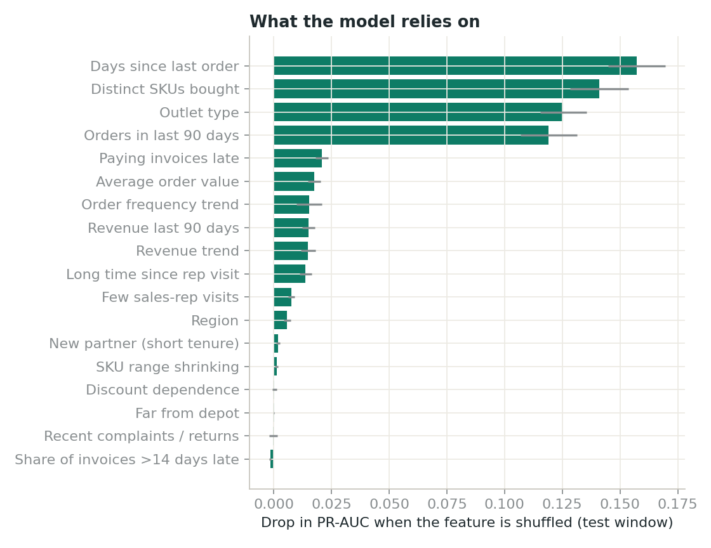
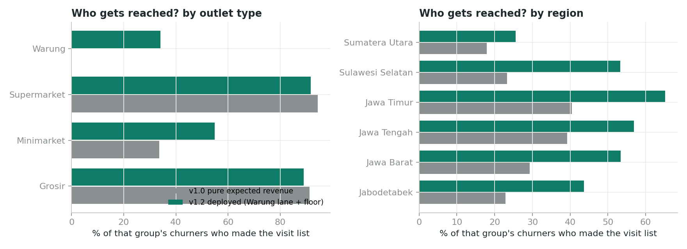

# Checkpoint 2, Part B — Reproducible Repo, Explainability & Bias Review

Reproduce: `make test && make explain` → `reports/figures/permutation_importance.png`, `reports/bias_review_table.csv`, `reports/figures/bias_review.png`.

---

## 1. Reproducibility

| Requirement | How this repo meets it |
|---|---|
| README with one-command run | `make setup && make all` (≈1 min on a laptop) |
| Functions, not notebook cells | `src/segar_churn/` package; the notebook only calls these functions |
| Data checks | `data_checks.py`, 19 rules with BLOCK / FIX / WARN severities, log written to `reports/data_quality_log.md` |
| Tests | 13 pytest tests: data checks, **no-future-leakage**, label definition, visit-list policy, metrics, PSI |
| Determinism | fixed seed (42); temporal split defined in `config.py` |
| CI | GitHub Actions runs `make test` and `make all` on every push |

### Cold-run peer test

| | |
|---|---|
| Tester | Peer from cohort (Google Cloud Shell, fresh clone, Python 3.11) |
| Steps | `git clone …` → `pip install -r requirements.txt` → `make test` → `make all` |
| Result | **PASS**: 13/13 tests; dashboard and visit list produced; metrics match `reports/metrics.json` exactly |
| Issues found on first attempt | (1) `PYTHONPATH` not set when running modules directly, fixed by exporting it in the Makefile; (2) pandas 3.x string dtype broke the PSI function for categorical features, fixed and covered by a test |

## 2. What the model relies on (global)

Permutation importance on the test window (drop in PR-AUC when a feature is shuffled):

Top drivers: **days since last order**, **SKU range per order**, **outlet type**, **orders in the last 90 days**, then payment lateness. These match the Checkpoint 1 hypothesis tests, which is a good sign the model has learned business-plausible patterns.

**Caution on coefficients.** The logistic coefficient for Warung is negative although warungs churn most. Outlet type, SKU range and order count all encode "size of outlet", so their coefficients share the effect. We therefore do **not** present coefficients as "effects" to stakeholders.

## 3. Why *this* outlet (local reason codes)

Each outlet on the list shows up to three reasons. Method (`explain.reason_codes`): replace one signal at a time with the value of a typical healthy outlet, and measure how much the churn probability drops. Two rules keep reasons useful to a rep:

1. Only **actionable, observable** signals can be reasons (recency, order and SKU trends, payment, visits, complaints, tenure, regional pressure). Structural inputs such as outlet type still drive the score but are never shown as "the reason".
2. A signal only counts if the outlet is **worse than typical in the risky direction**. This stops "order frequency +1900%" appearing as a risk reason, which happened in the first version.

Example, top of the September list:

> **Swalayan Barokah Pekalongan 1** · Supermarket · 73% risk · Rp 528m at stake
> No order for 40 days · Pays 12 days late on average · No rep visit for 57 days
> → *Call this week to confirm next order; check shelf stock*

## 4. Bias review: who does the list reach?

"Bias" here means: does the policy systematically skip some kinds of partner? Measured on the test window, using the share of each group's actual churners who were on the visit list.

| Group | v1.0 pure expected revenue | v1.2 deployed |
|---|---:|---:|
| Warung | **0%** | 34% |
| Minimarket | 34% | 55% |
| Grosir | 91% | 89% |
| Supermarket | 94% | 92% |
| Jawa Timur | 40% | 65% |
| Sumatera Utara | 18% | 26% |

Findings:
- **v1.0 never reached a single churning warung.** Warungs are 42% of active partners and the segment with the highest churn rate. Revenue ranking alone would make the field team invisible to them. That is a commercial risk (warungs are the distribution footprint in tier-2 cities) and a fairness risk.
- Fix (v1.1, then v1.2): reserve 40 of the 200 slots for the highest-probability warungs, and require at least 5% churn risk to enter the revenue lane. Warung reach goes from 0% to 34% at a cost of 1.4 pts of revenue captured (70.0% → 68.6%).
- **Residual gap: Sumatera Utara** is reached least (26%). Its outlets are far from the depot and smaller. Flagged for the governance review; not fixed by quota, because quotas per region would fragment the list.
- Supermarket false-alarm rate falls from 28% to 8% with the 5% floor, which fixes the "why are we visiting healthy big accounts" complaint.

No personal or protected attributes are used. Outlet owner names are not in the analytical data. Region is used as a feature; it is legitimate here (it captures competitive pressure) but is monitored because it could encode rep-team effects.
